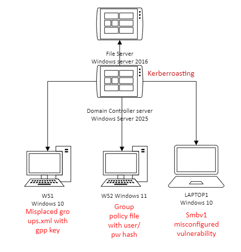

## SisuARC lab structure

### 1. **Misplaced groups.xml with GPP key (WS1)**  
   - Group Policy Preferences (GPP) voi tallentaa salasanoja **groups.xml**-tiedostoon, joka voi löytyä **SYSVOL-kansiosta**.  
   - Hyökkääjä voi purkaa AES-salauksen ja saada hallintatason tunnukset.  

### 2. **Group policy file with user/password hash (WS2)**  
   - Salasanoja voi vuotaa **Group Policy -tiedostoissa**, esim. rekisteri- tai skriptitiedostoina.  
   - Hyökkääjä voi käyttää **hash-kaappausta** ja murtaa salasanan offline-tilassa.  

### 3. **SMBv1 misconfigured vulnerability (LAPTOP1)**  
   - SMBv1 on vanhentunut protokolla, altistaa **EternalBlue**-hyökkäyksille (kuten **WannaCry**).  
   - Mahdollistaa **etäkäyttöoikeuksien laajennuksen** ja haittaohjelmien leviämisen.  

### 4. **Kerberoasting-vulnerability (Domain Controller Server)**
   - DC voi olla altis **Kerberoastingille**, jos palvelutilien **SPN-salasanat ovat heikkoja**.  
   - Hyökkääjä voi pyytää **Kerberos TGS** -tikettejä ja yrittää murtaa ne offline-tilassa.  
