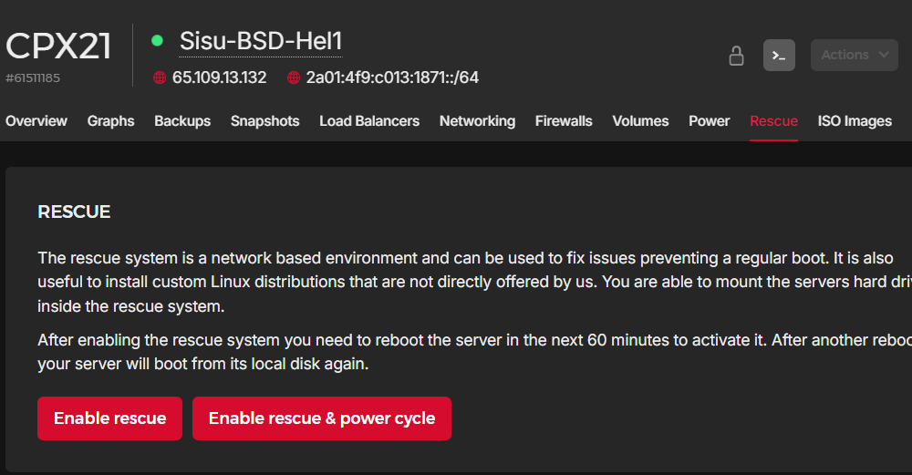
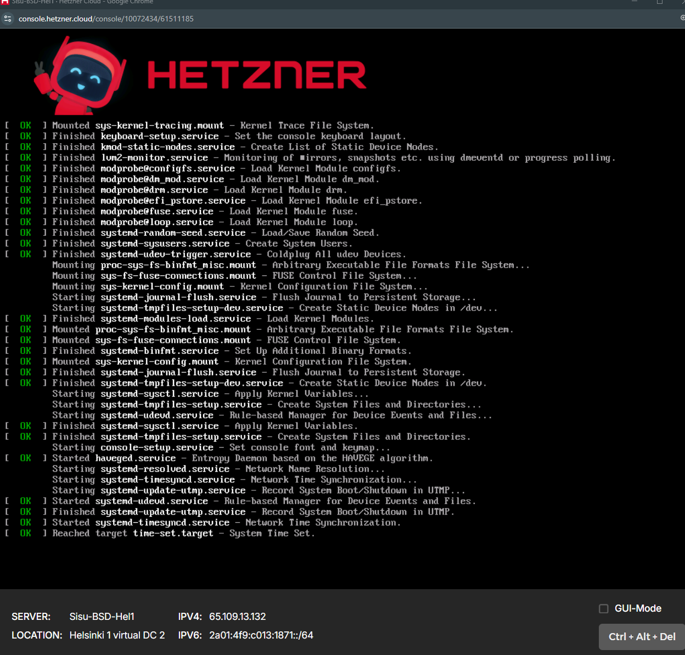
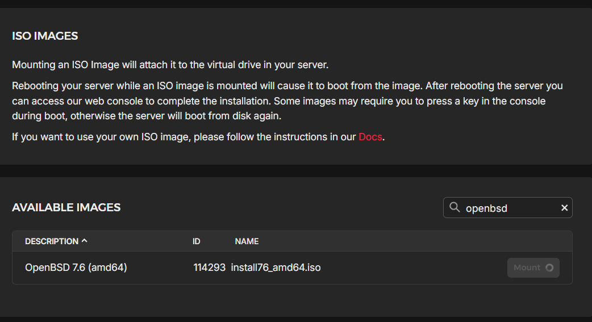
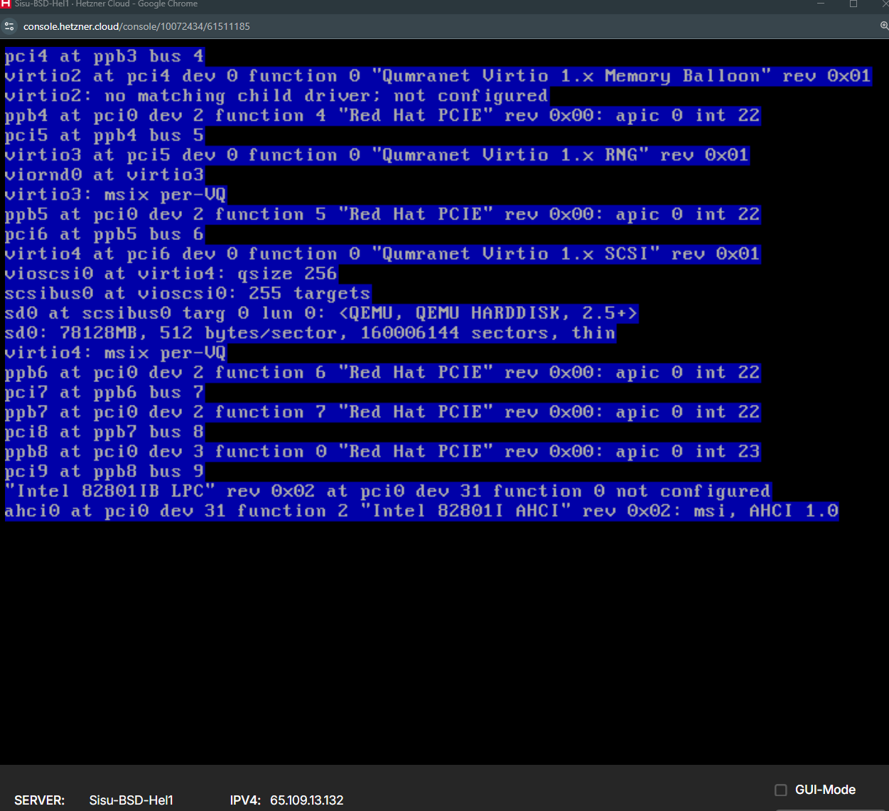
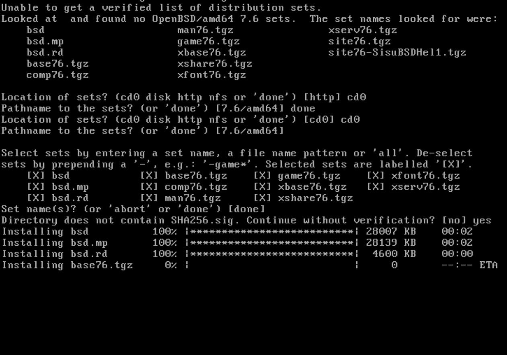
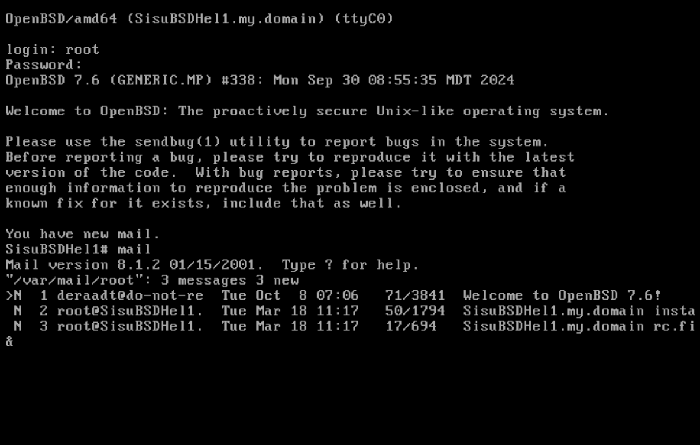
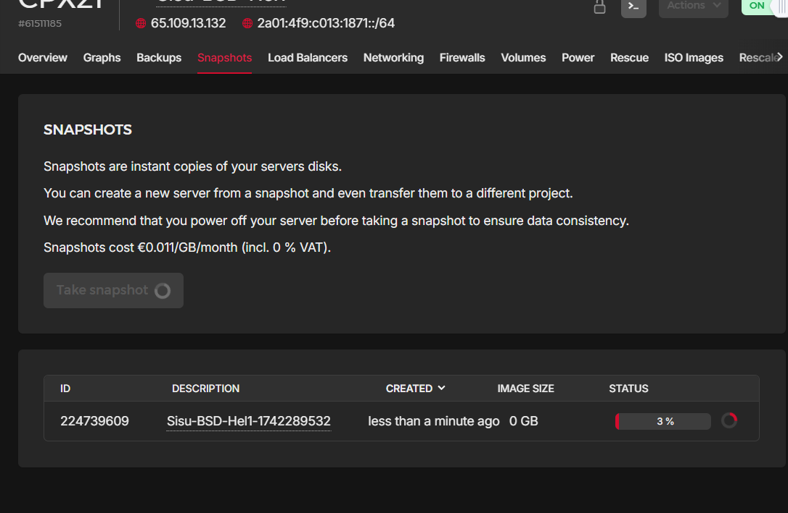

## Maybe OpenBSD?

After running into several issues with the docker installation of echoCTF, the developer of the platform had suggested to use OpenBSD.

OpenBSD is not available to install on our preferred hosting platform hetzer, so it has to be installed with rescue mode and mounting custom image:

Booting server into rescue:

booting into openbsd image:

choosing settings 

first login of installed openbsd on hetzner

taking a snapshot of the server to avoid having to install it again if something goes terribly wrong.

this was wild goose chase.

## Not like this

After installing openbsd and learning a bunch of it, i joined the EchoCTF.RED discord, where the main developer admitted that there are lots of bugs and he does not have time to fix it. In our time frame and scope, we had to look for something else.