## This is a documentation of the creation of a VirtualMachine with a GPO misconfiguration

### 1. Installation and network configuration
- First of all download the image files. This time I decided to use: 
  - Windows 10 Pro (https://www.microsoft.com/en-us/software-download/windows10?msockid=0d1a47f1d26963fc37db5342d3416219)
  - Windows Server 2025 (https://www.microsoft.com/en-us/evalcenter/download-windows-server-2025?msockid=0d1a47f1d26963fc37db5342d3416219)

- Then make sure you choose to install the Pro version of Windows 10 and Standard Evaluation (Desktop Experience) version of the Windows Server 2025
- After installation it is time to put both computers on the same internet

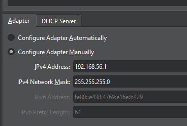
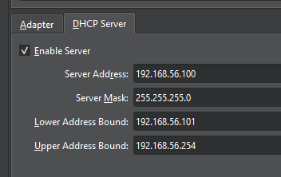
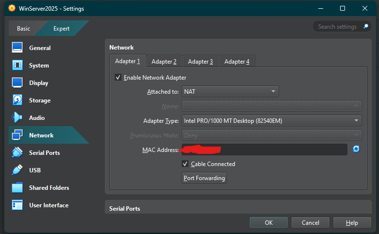
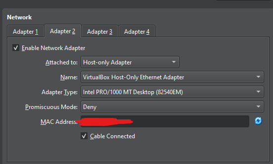

- Above are the network card settings
- You also need to set both computers to the 'Host-only Adapter' network
- I left the Windows Server 2025 also with NAT networking since I might need to access the internet from it

### 2. ICMPv4 enabling
- In order to verify connection between the computers we should be able to send ICMP packets
- This is normally disabled so using the this line of code ``netsh advfirewall firewall add rule name="Allow ICMPv4" protocol=icmpv4 dir=in action=allow`` we can enable it

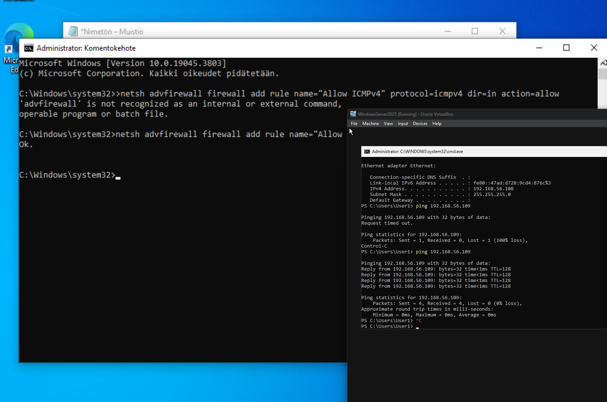

- Above there is also ping test ran from the 2025 server pinging the Win10 machine
- It is a success so there is a working connection between the computers

### 3. DNS and Domain basics
- In order for our computer to connect to the domain they must use the DNS server offered by our Domain Controller hosted on Windows Server 2025

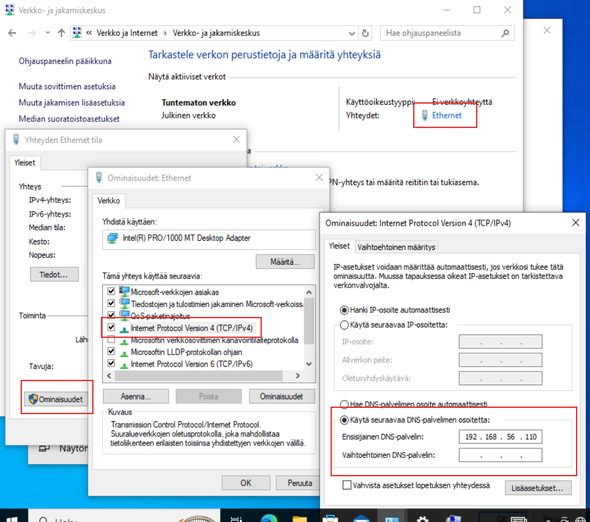
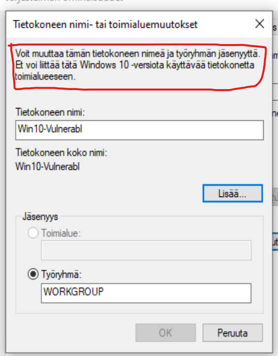

- Above is the DNS configuration used in our environment
- But things cannot run smoothly so while doing the configuration I noticed that Win10 Home machines cannot be added to a domain
- I asked you from the start to install the Win10 Pro version to avoid this issue

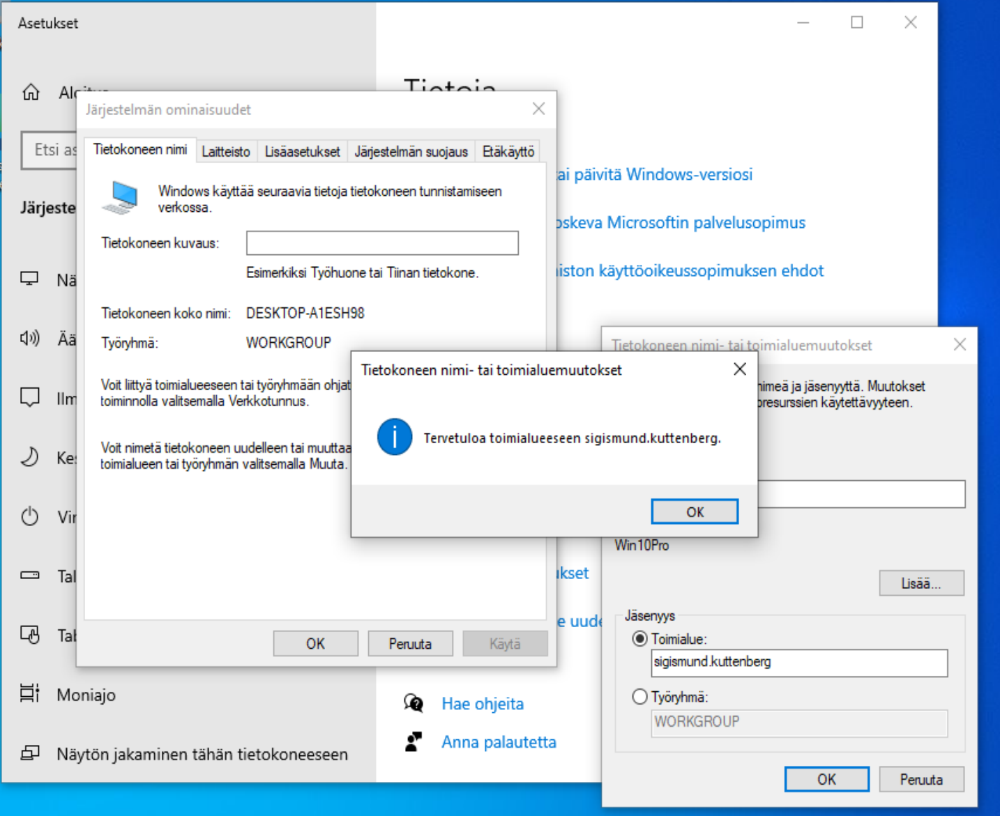

- Well when you have done things once it doesn't take that long to replicate
- I successfully added the Win10 Pro computer to the domain ``sigismund.kuttenberg``

### 4. Domain user and group configuration
- I did a lot of research and looking around, there was so much interesting stuff

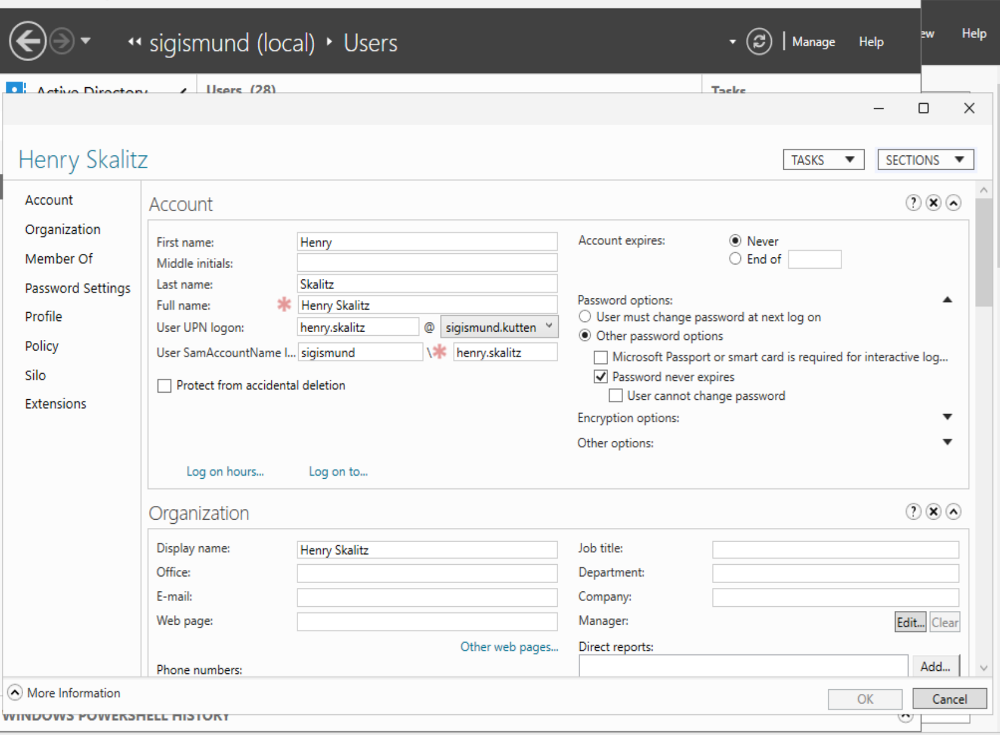
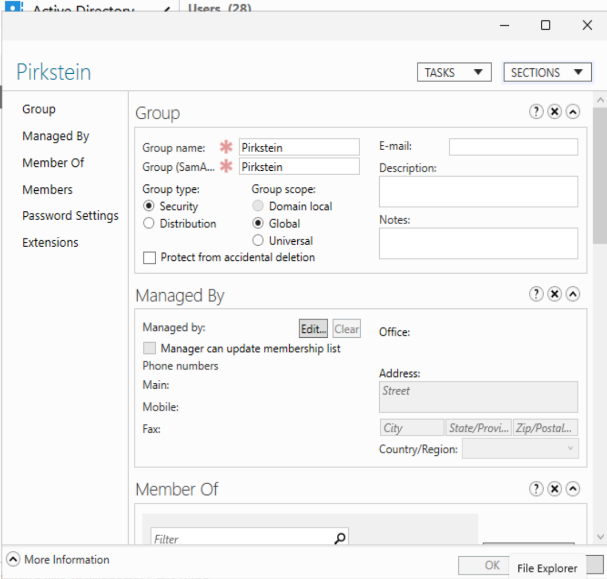

- I decided to do a user and a group to add that user in
- This would enable me to inspect files in the domain from the Win10 Pro computer using these credentials
- This would lead us eventually to be able to inspect the vulnerable group.xml file which would contain an encoded but unencrypted password of another user

### 5. GPO misconfiguration

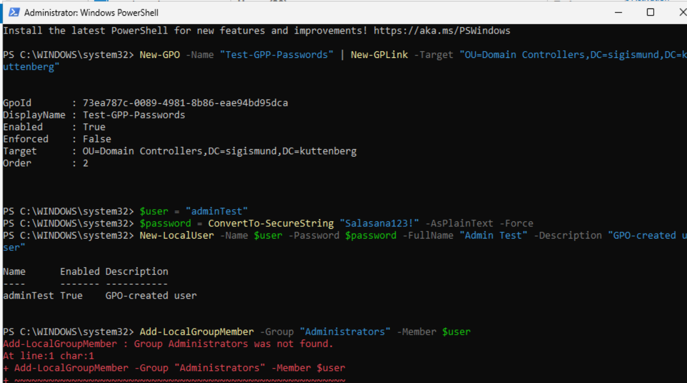
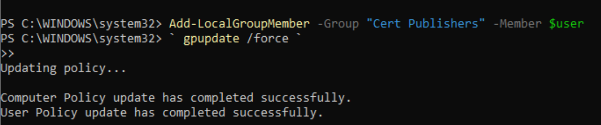

- So I ran into a problem. I couldn't locate a local group called 'Administrators'
- I thought about it for a while but didn't come up with anything so I decided to give it a try with any group. Here I used 'Cert Publishers'

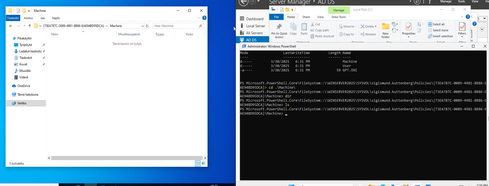

- So the command should make a file called group.xml in the Domain Controllers shared folders so all users in the domain could inspect the file ``\\sigismund.kuttenberg\SYSVOL\sigismund.kuttenberg\Policies\{3182F340-016D-11D2-945F-00C04FB984F9)\MACHINE\Preferences\Groups``
- The weird thing is that the folder for the GPO is generated but there is nothing inside the folder

### EDIT (6.4.2025):
- After some research I found out that an update (KB2962486; https://support.microsoft.com/en-us/topic/ms14-025-vulnerability-in-group-policy-preferences-could-allow-elevation-of-privilege-may-13-2014-60734e15-af79-26ca-ea53-8cd617073c30) made the GPP misconfiguration impossible since it has been blocked.
- I will now try to replicate the misconfiguration first in 2019 version and if that doesn't work in 2012 version which does not have the patch at all. In the 2019 version the GUI option for the misconfiguration has been blocked but it might be possible to do the command in CLI

### EDIT (24.4.2025)
- So I have repeated the same steps until part 5. Now we are going use a WindowsServer 2012, which is vulnerable to the GPP misconfiguration.

.png)

- Installing correct versions to proxmox

.png)

- Making sure the computers are connected

.png)

- Properties of the created user attached to group "ALL" for Win10Pro end device

.png)

- Issuing an update across the domain to change the Administrator password
  
.png)

- group.xml file of the misconfiguration
- cpassword is vulnerable because it is encrypted using an expired AES key

### EDIT (1.5.2025) (https://github.com/t0thkr1s/gpp-decrypt/blob/master/README.md)

.png)

- AES decrypted on a kali machine using t0thkr1s's gpp-decrypt script

## References
- https://www.server-world.info/en/note?os=Windows_Server_2025&p=initial_conf&f=6
- https://www.youtube.com/watch?v=sTedpt47t2Y
- https://learn.microsoft.com/en-us/windows-server/identity/ad-ds/get-started/virtual-dc/active-directory-domain-services-overview
- https://serveracademy.com/blog/active-directory-101-a-step-by-step-tutorial-for-beginners/
- https://learn.microsoft.com/en-us/entra/identity/hybrid/cloud-sync/tutorial-basic-ad-azure
- https://hammersoftware.com/how-to-create-and-edit-a-gpo/
- https://github.com/t0thkr1s/gpp-decrypt/blob/master/README.md
