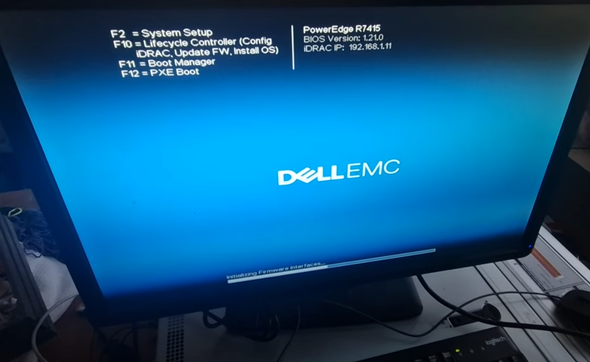
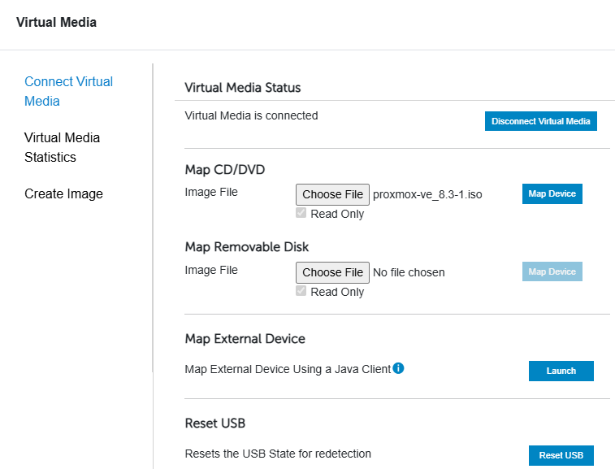

## Preparing hardware

### Background

Inherited server hardware from previous project, no knowledge of user/password data.

### Specs

### Booting up servers

Servers couldnt be reached via dhcp, iDRAC settings dont seem to be default. 

Figured best & fastest solution is to connect monitor&keyboard&mouse to the server for resetting settings.

Navigating from bios to iDRAC reset settings:

Resetting to default

### iDRAC web interface

Finally when settings were reset, the iDRAC port was given ip from dhcp on router

Tried default passwords root/calvin, not working.

Server was initially ordered with secure addon, meaning password was printed on the plastic id tag on the server

After login, we need to download the proxmox assets/image:

To install the assets/image, we add a virtual cd&/dvd drive to the iDRAC:

install location

# Router setup

edgerouter pro 8

Aquired used hardware, password unknown, from ubuquiti manual trying Resetting

this works, user ubnt pw ubnt 

Updating firmware:

# Trying VDI connection to school lab environment

Our teacher Harto mentioned that our ip-space for the server would be accessable through the vdi connection, however we could not access the router through vdi:

Sending inquiry about vdi to teachers via email.