# Setting up webmail + smtp for SisuCTF.com

Echoctf framework uses smtp to send email to users. This all has to be setup manually, google smtp relay is recommended(google workspaces subscription)Google is easy and usually trustworthy relay(not getting flagged as spam/junk). but we opted to go for a cheaper route with some more work(DKIM). 

Plan: mxroute & DKIM Records to avoid getting flagged as spam


## DNS Records for email

Adding Custom MX records on our dns provider (namecheap)

For our mxroute account we have been assigned following:
```
wednesday.mxrouting.net (Priority 10)
wednesday-relay.mxrouting.net (Priority 20)
```
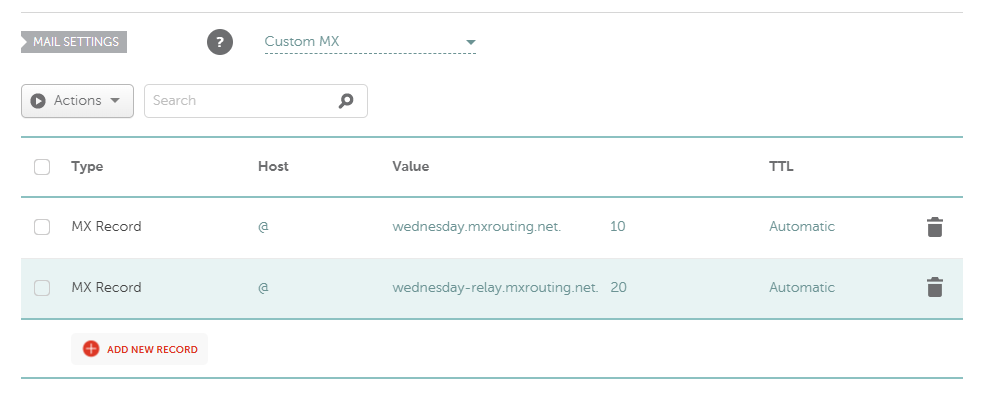

TXT SPF record:

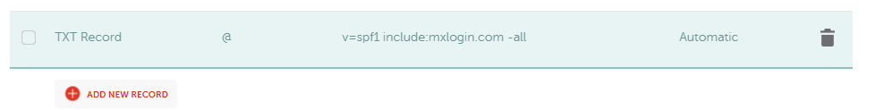


DKIM+DMARC records:

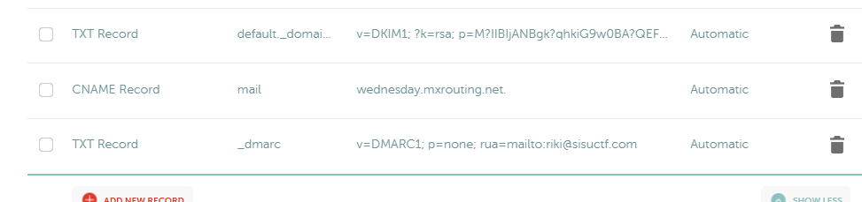

## Webmail send + recieve

Setting up new domain on mxroute

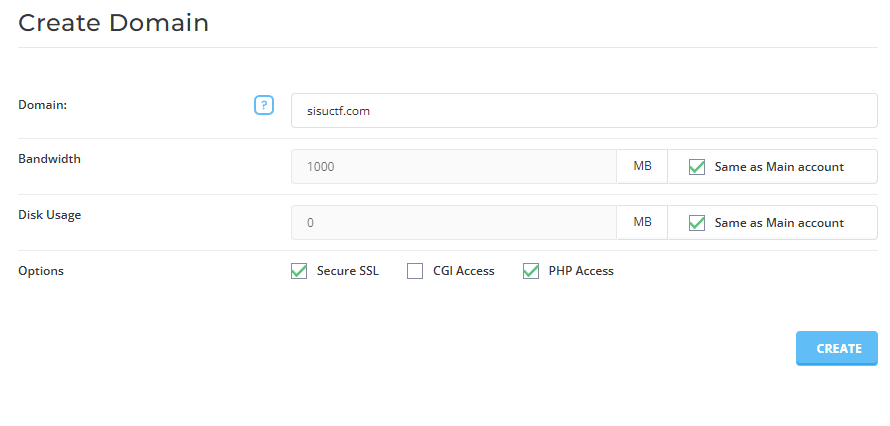

Creating a test address riki@sisuctf.com

testing email sending from mxroute webmail with sisuctf domain to outlook

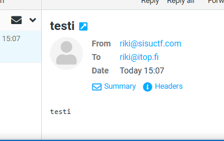

Email sending works, but identified as spam/junk, trying this later since records might still be propagating. 

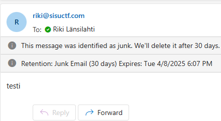

using toolbox.googleapps.com to test records, not yet active.

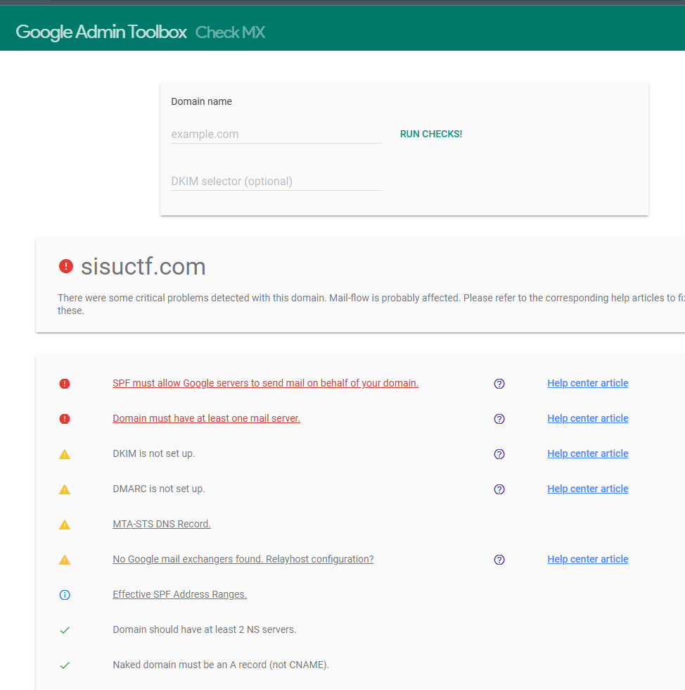


Testing reply from outlook to riki@sisuctf.com

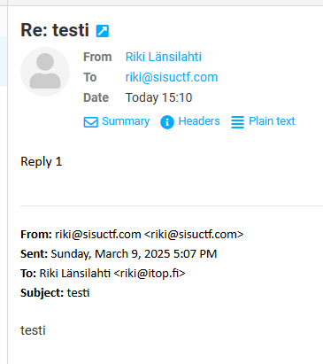

works!

## Setting up mail.sisuctf.com webmail

Setting DNS record for subdomain mail.sisuctf.com

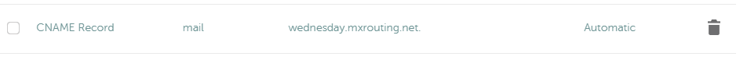

SSL certificate setup on mxroute, using letsencrypt automatic cert.

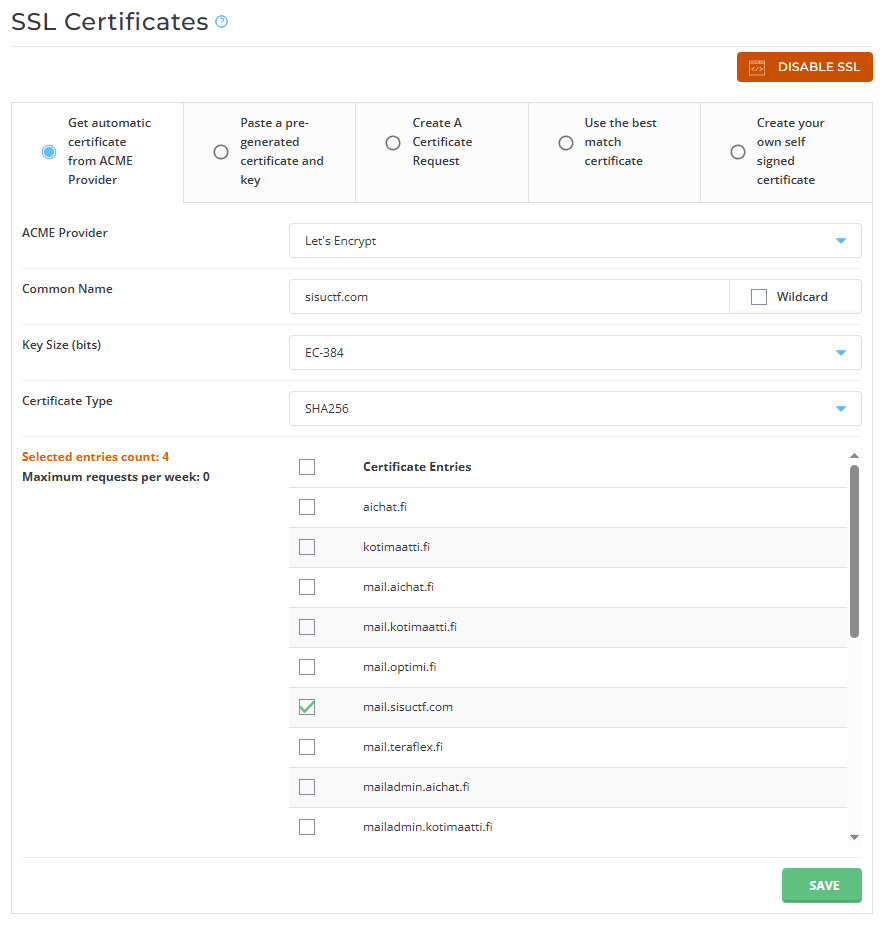

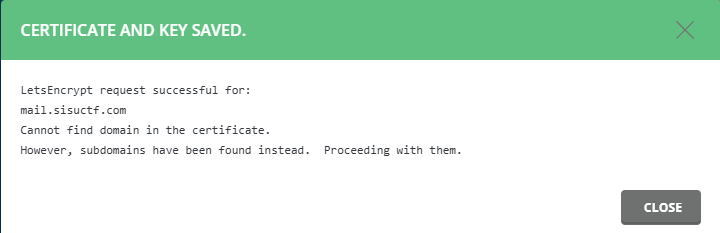

webmail works with custom subdomain:

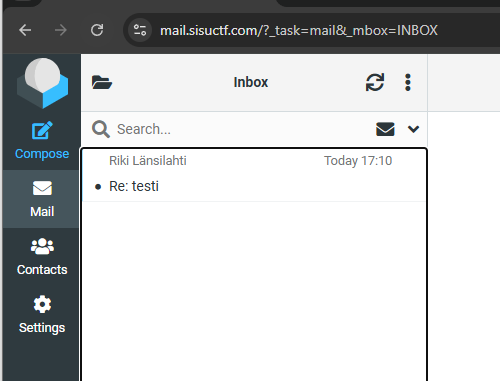

## modified to use STARTTLS


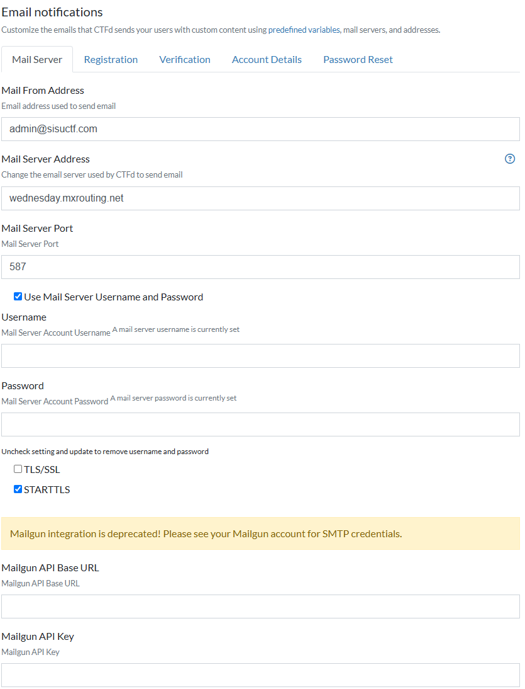