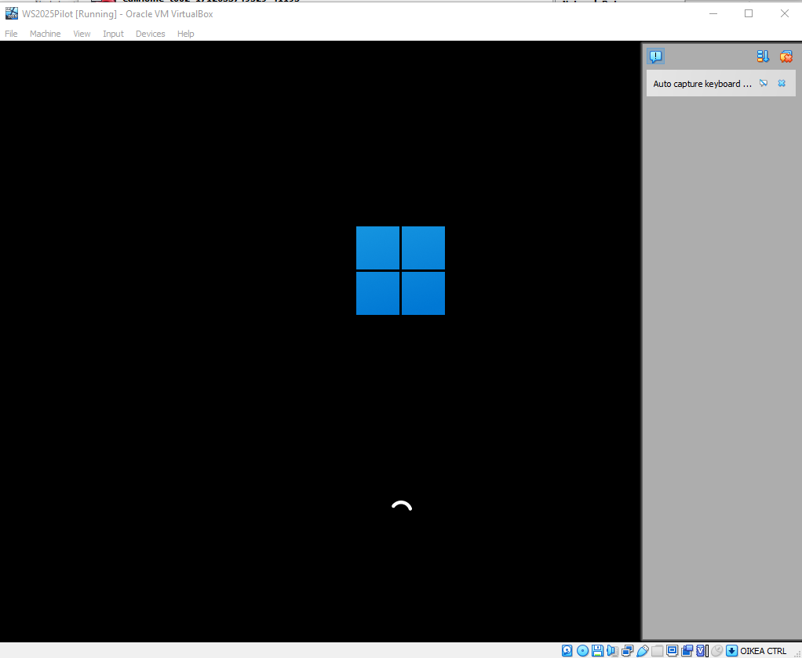

# Pilot VM windows server 2025 locally

## Setup machine & Netwrok locally

This is a short report on installing our first vulnerable VM, in a local vm network setting.

Windows Server 2025 iso from https://www.microsoft.com/en-us/evalcenter/download-windows-server-2025


For piloting purposes, this host is locally installed and ran on virtualbox, virtual disk greater than 12gb, choose skip unattended install to enable version selection & choosing desktop experience



Encountered error installing to selected partition on default settings, after deleting default partition and choosing unnallocated space, the install could continue.


During install, only options to change was updates to manual, and remote enabled


Enable icmpv4 pinging as per steps here https://www.server-world.info/en/note?os=Windows_Server_2025&p=initial_conf&f=6


Now network is setup between attack vm and target vm


## Add some vulnerability (smb share)

install smb1, create vulnerable share


Enable Guest user on the server with following commands

```
Get-LocalUser Guest

Enable-LocalUser -Name Guest

net user Guest /active:yes
```
Grant rights on VulnShare
```
icacls "C:\VulnShare" /grant Everyone:F /T /C /Q
icacls "C:\VulnShare" /grant "ANONYMOUS LOGON":F /T /C /Q
```

restart smb
```
Restart-Service LanmanServer
```


Now shares are discoverable, and the Shared & VulnShare folders are readable