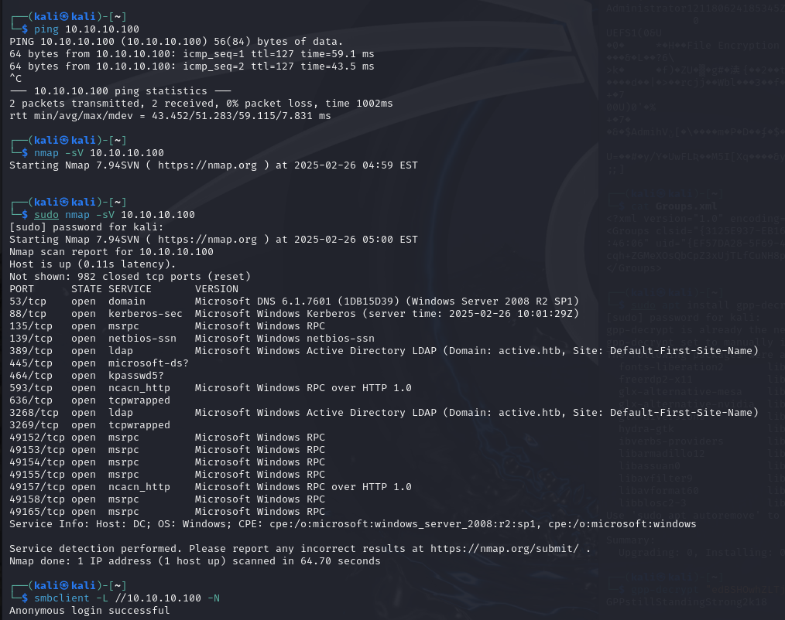

short memo/wriuteup of example easy windws  smb / active directory vulnerability target machine on hackthebox

"Active is an easy to medium difficulty machine, which features two very prevalent techniques to gain privileges within an Active Directory environment."

Enumerating the target host

found accessable share with anon access

browsed through files to find a password (hinted on hackthebox)

found groups.xml containing encrypted password 

cracked with gpp-decrypt

accessed smb share with previously gained user/pw info

found flag file on users desktop

User owned, moving on to root

Kerberoasting:

with previouslly gained credentials, scanning for kerberoasting accounts

TGS-REP hash found

cracking the hash

`hashcat -m 13100 kbhash.txt /usr/share/wordlists/rockyou.txt --force --attack-mode=0`

With the admin credentials, going back to smb share, we now have access to the administrator folder on the share Users

root flag found on desktop

