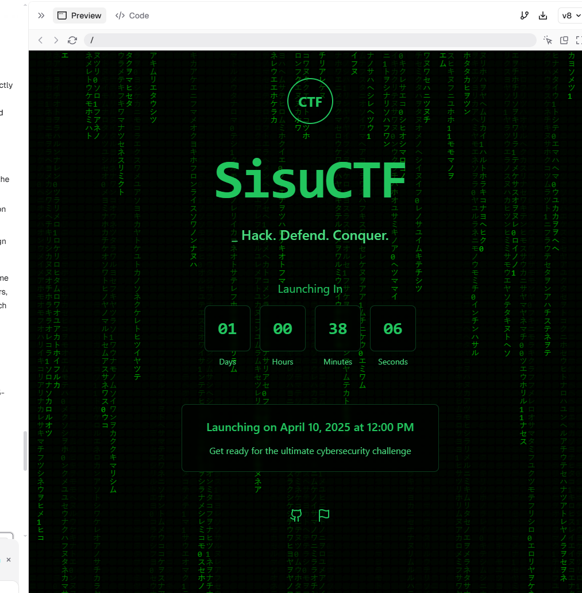
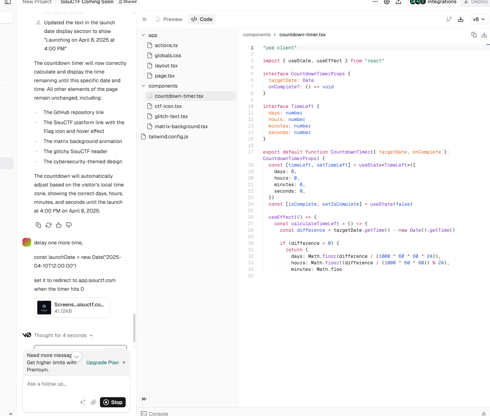

## countdown landing page

the countdown landing page was fully done using the vibe coding method, using vercel to host and v0.dev to develop, the landing page was generated by telling the AI what we need, we did not touch the code at all. this method was used to save time for more important tasks.

In total to setup the initial page with domains connected took less than 1 hour, edits were super fast also.

initial prompt was 

*"create a super modern landing "coming soon" page for our SisuCTF website, make it have some hacker themed moving background and glitchy header text"*

When we had to delay the release i went back to the app telling it to delay and move the time.

"delay one more time" our last prompt, and told it to add redirect when countdown hits 0(lets hope it works).

After time reached 0, the redirect worked.