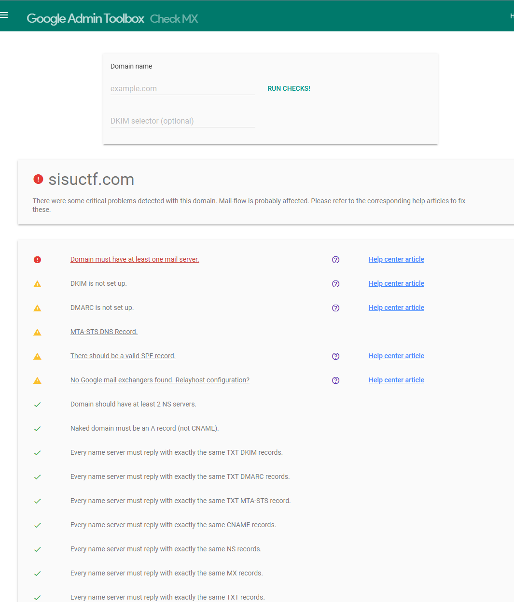

# Part 2 smtp setup on CTFd framework

Mail sending now works, however its tossed into junk, troubleshooting with googles tool:
toolbox.googleapps.com

comparing my known working settings on another dns panel, seems namecheap did not add the domain into host field automatically.

still not working, creating an account for postmaster.google.com

no data found even when sending to gmail, but found out mails to gmail dont even reach the junk folder. trying dnschecker.

found my dkim and dmarc txt records are not seen, maybe issue with namecheap? waiting for a while if they come up and thinking about moving to hetzner for dns server(have other working setups there).

hetzer automatically scans most of current dns settings

adding rest manually

Now email sending works to my own company address, but for some reason sending to gmail does not work

after some googling found out that the test mail maybe not going through since it has no subject:

source: https://www.mailgun.com/blog/deliverability/prevent-gmail-blocking-emails/

That wasnt the issue, finally got resolved, spf record was missing on hetzner, after setting this correctly, email works to all addresses, and not being flagged as spam/junk:

