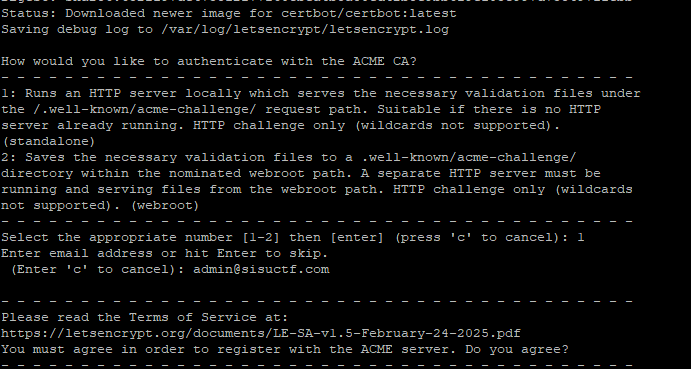
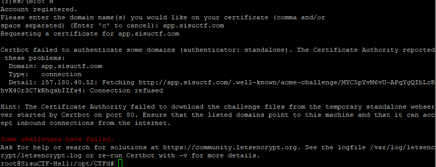
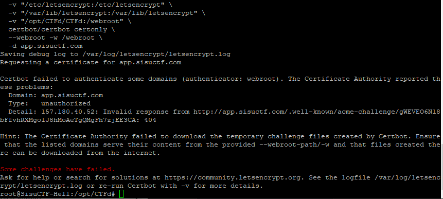
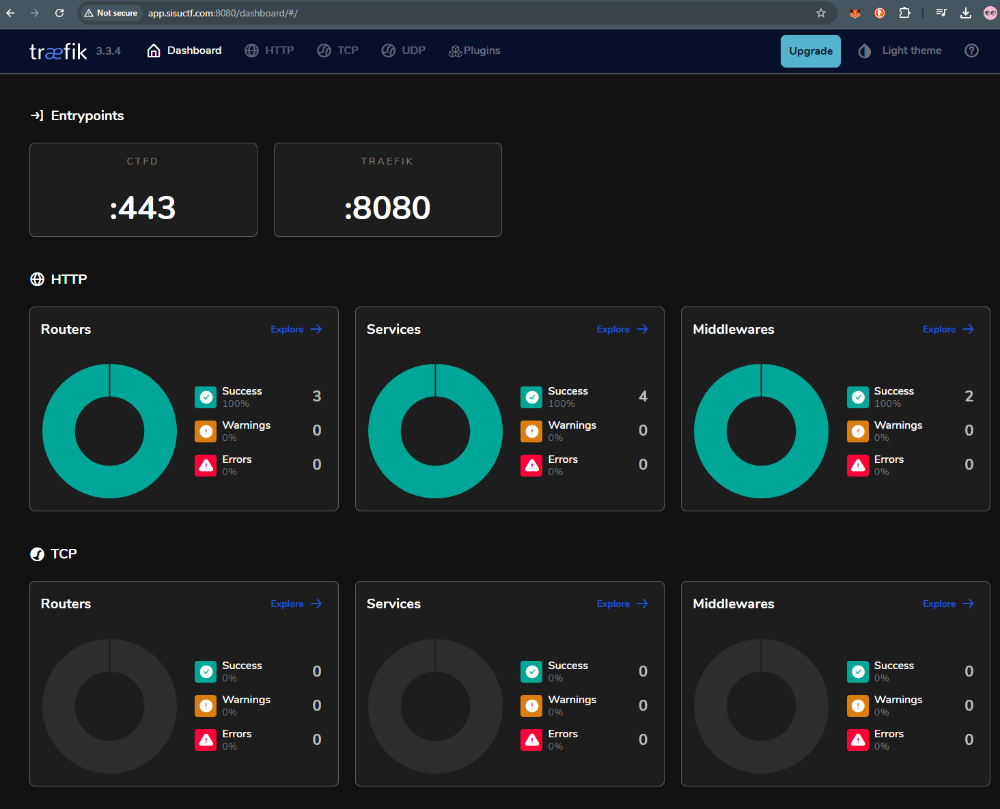

# week 13 webapp setup notes, tls

Encountered problems in week 12 while enabling letsencrypt, resulted in server having lots of issues. Since the site content was not much edited, decided to do a fresh install and have a private github repo for just the webapp content for better control over the app.

Creating new repo and adding deploy key for the server, setting up keys.

creating a plugin-testing branch

`git checkout -b plugin-testing`

## theme neon

installing theme neon

`git clone https://github.com/chainflag/ctfd-neon-theme.git /opt/CTFd/CTFd/themes/neon`

after downloading the theme files, we choose the theme from the backend admin panel:


## TLS

Certbot Let's Encrypt setup for CTFd

Having used the LetsEncrypt before, but never as a docker, so following guide from: 

https://dev.to/roeeyn/how-to-setup-your-ctfd-platform-with-https-and-ssl-3fda#5-add-a-certificate-with-certbot-lets-encrypt


```
docker run -it --rm --name certbot \
          -v "/etc/letsencrypt:/etc/letsencrypt" \
          -v "/var/lib/letsencrypt:/var/lib/letsencrypt" \
          certbot/certbot certonly

```

we choose the standalone type



ran into issues with authenticating the domain




Got some advice from chatgpt to not use the standalone type install, and instead serve from the webroot with command:

```
docker run -it --rm --name certbot \
  -v "/etc/letsencrypt:/etc/letsencrypt" \
  -v "/var/lib/letsencrypt:/var/lib/letsencrypt" \
  -v "/opt/CTFd/CTFd:/webroot" \
  certbot/certbot certonly \
  --webroot -w /webroot \
  -d app.sisuctf.com
```

By the looks of it i need to start dockers back up so the ctfd docker can host the acme challenge

still running into issues



this time 404, so our nginx is blocking access.

editing nginx http.conf to include:

```
    location ^~ /.well-known/acme-challenge/ {
      root /opt/CTFd/CTFd;
      default_type "text/plain";
      try_files $uri =404;
    }
```

restarting dockers with

```
docker-compose down
docker-compose up -d --build
```

at this point i realized im doing this way too hacky and this isnt going to work for cert renewals. im looking into other options.

## scaledCTFd setup

looked into several other options and solutions from other users, 

https://github.com/chrisandoryan/ScaledCTFd/

this looks promising, and built with traefik loadbalancing.

downloading the scaledCTFd files, editing run.sh

`docker-compose down`

`chmod +x ./run.sh`

`./run.sh`

after some minor folder issues with data/ folder, now the traefik status page works and the page works with cert/https



## adding secret key

compared previous version and noticed i was missing secret key, added manually and to restart only the ctfd docker of the swarm

first check to find if it has the secret done automatically, find docker id with

`docker ps`

then 
```
docker exec -it <container_id_or_name> env | grep SECRET

```

manually insert secret key to yml, then restart:

```
docker stack deploy -c docker-compose.yml scaled_ctfd_traefik
```

now the docker exec grep shows the secret key, and i noticed the webapp required re-login.

## new swarm setup upload issue

troubleshoointn new swarm system had issue where i couldnt upload anything to the uploads folder (our logo for example)

some troubleshooting later found that the folder was missing some righst

fixing rights to folder fixed the problem