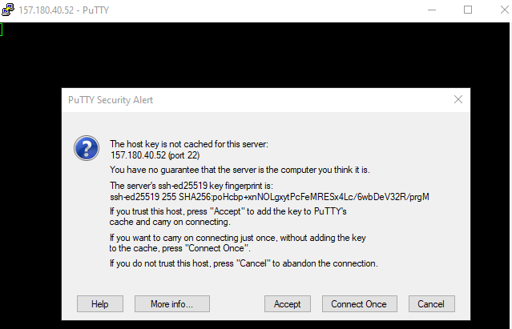

## Setting up the CTFd framework

New server on hetzner, ubuntu 24.05 image, 4gb ram, amd shared 3cpu, possibility to upgrade later


connecting to vps:




### updating server

```
apt update && apt upgrade
```

### prerequisities

Just docker for now

```
apt install docker.io docker-compose
```

cloning the github into /opt/

```
git clone https://github.com/CTFd/CTFd.git
```

Setting up secret key in docker-compose.yml

### Theme

Choosing a theme from
https://github.com/CTFd/themes

https://github.com/hmrserver/CTFd-theme-pixo/

Trying this out to be a starter

cloning the theme into /opt/CTFd/CTFd/themes

starting up the docker

```
docker-compose up
```

### First startup

first startup on the webapp launches the setup


We chose user mode for our platform, (no teams)


