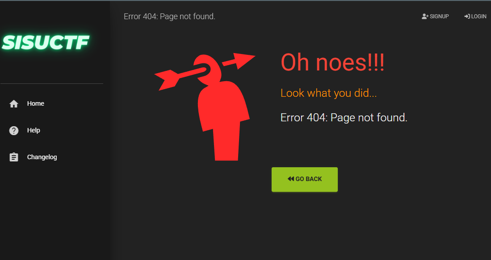

## EchoCTF.RED

setting up echoctf with docker images form 

```
docker pull echothrust/echoctf.red-db:latest
docker pull echothrust/echoctf.red-backend:latest
docker pull echothrust/echoctf.red-frontend:latest
docker pull echothrust/echoctf.red-vpn:latest
chmod a+rw frontend/web/images/{avatars,avatars/badges,targets}
docker-compose up
```

init database

```
docker exec -it echoctfred_db bash -c "mariadb < /etc/mysql-init.sql"

```

This install resulted in several issues and errors, we soon realised the guide was not really getting started from zero, it did not mention what we needed to install before..

After a couple days of trial and error, we finally managed to get the echoCTF platform up and running

however there was many issues, first live install did not have a database connection, resulting to all content missing 404



After we finally got the issues resolved on the third or fourth reinstall of the whole system, we got into some other issues:

File upload not working, emails not sending

Joined the echoCTF discord for some help, after searching previous questions, the solo developer of the framework just told others to "use OpenBSD", "the docker system is not intended for production.." etc.

-> [lets try openbsd?](BSD_setup.md)