# configuring proxmox server remotely pt1

finally gained access to server remotely

trying to update with apt update, its not working

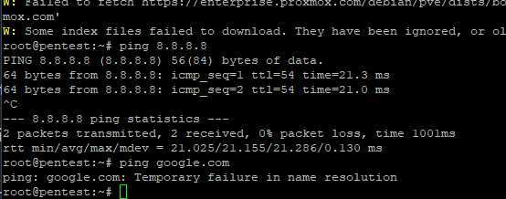

ip ping works, but domain ping not. seems dns is misconfigured.

etc/resolv.conf was misconfigured

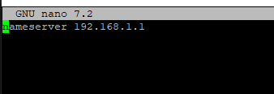

our assigned dns servers also did not work, seems some routing changes were made to the network when trying to give us access

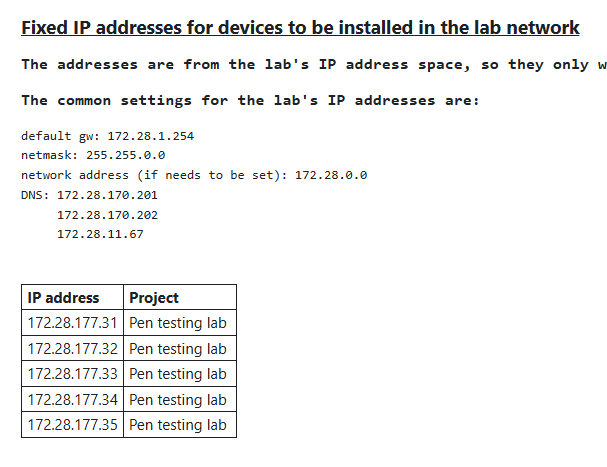

resolved issues by using 8.8.8.8 dns


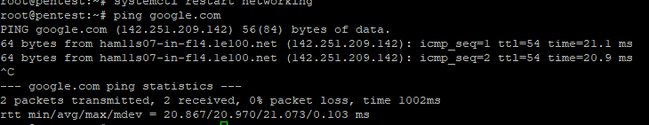

some basic hardening for now:

installed fail2ban with configuration:

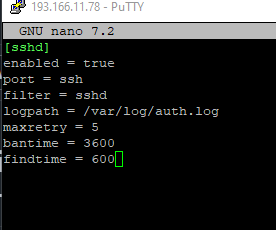

this didnt work, changed config to backend = systemd. and restarted the service.

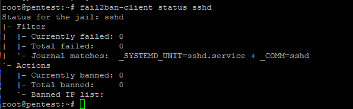

udp echo testing for routed ports 1194 and 51820

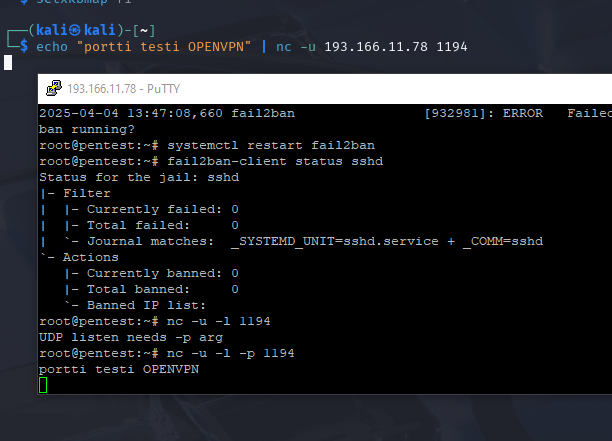

openvpn works, lets test WG

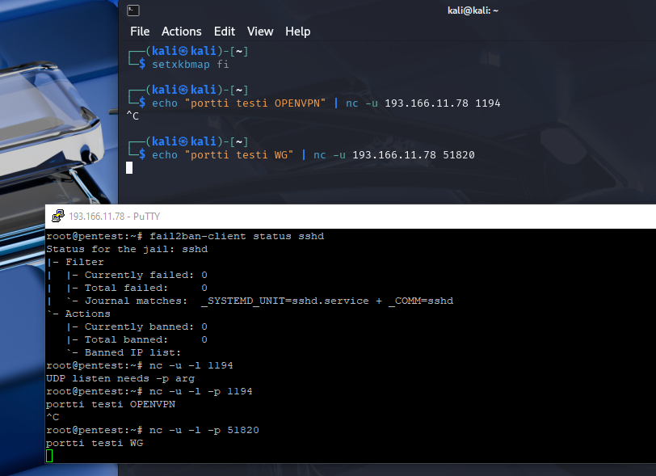

seems to work!

testing fail2ban

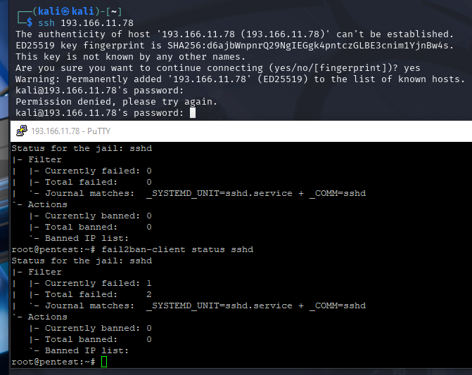

seems to be active.

now moving to securign other ports from internal lab network access

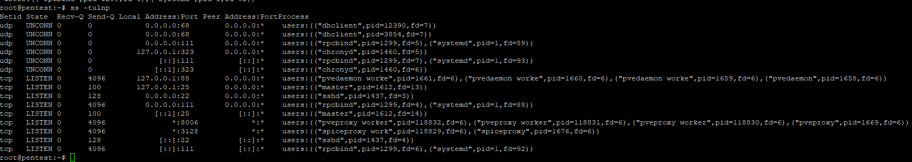

```
apt install ufw

ufw allow ssh

ufw allow 1194/udp

```

checking config to make sure we dont lose ssh access:

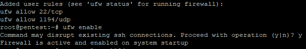

ufw status

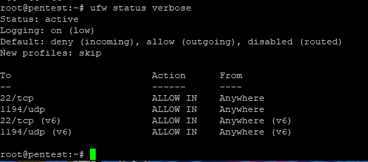

