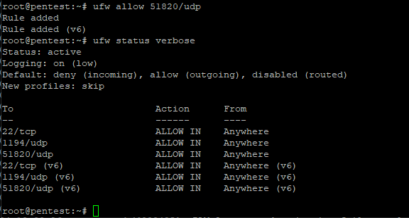
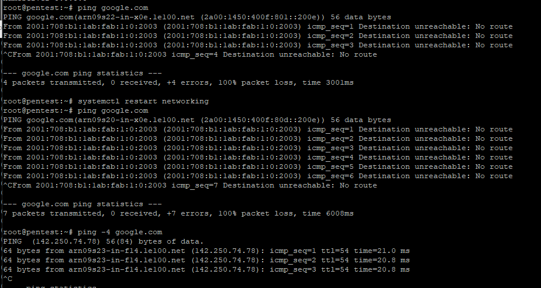

# proxmox notes pt2

setting up WG on main host

first allowing the port



ran into problems installing anything suddenly. seems like another DNS issue, but this time its something else

the network is trying to default into ipv6, but its not working for us.



solved with creating
`nano /etc/sysctl.d/99-disable-ipv6.conf`

adding
```
net.ipv6.conf.all.disable_ipv6 = 1
net.ipv6.conf.default.disable_ipv6 = 1
```

then
`sudo sysctl --system`

now pings work, moving on to install wg to access proxmox

mkdir -p /etc/wireguard

cd /etc/wireguard

```
wg genkey | tee privatekey | wg pubkey > publickey
```

after some issues finally had it working after manually adding peer with

```
 wg set wg0 peer <client_pubkey> allowed-ips 10.10.0.2/32
```


lastly setting up split-tunneling to only use wg for the server ip, and my own network for everyithing else

into the client config peer section edited:

`AllowedIPs = 10.10.0.1/32`

tested and it works perfectly.


