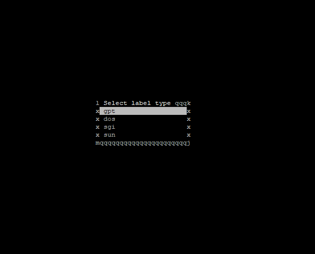

# proxmox pt3

After getting wireguard split tunnel and ssh access to the server, we are ready to install vms.

First problem was, none of the bigger drives are seen on the proxmox.


Looking if they are actually seen at all, i can find them here: 


Learning that if not using the dell hardware raid system, the next best practice is to use ZFS with mirror setup

We are going with  sda+sdb mirrored by sdc+sdd and sde as spare if one drive fails

cleaning old partitions
```
for disk in sda sdb sdc sdd sde; do
  wipefs -a /dev/$disk
done
```

creating our preferred mirror setup and verifying
```
zpool create zfs-vmlab mirror sda sdb mirror sdc sdd spare sde
```


we still have an nvme to use, now configuring them to do caching and logs

`cfdisk /dev/nvme0n1`




```
zpool add zfs-vmlab log /dev/nvme0n1p1
zpool add zfs-vmlab cache /dev/nvme0n1p2
```


now adding the newly created partitions to proxmox


datacenter -> storage -> add -> ZFS

noticed cant add iso store, so adding a dataset for the images

`zfs create zfs-vmlab/iso-store`

now returning to add zfs, we can see iso-store also-

but we go add -> directory


and then add ZFS

---

now getting iso images for vms


spending lots of time trying to find some good windows iso images, but seems they try to hide them all behind the "windows download tool/ installer"

finally found some images we can start testing with:


also corrected the dir, by mistake first downloaded into /mnt/iso-store/ but correct path was /mnt/iso-store/template/iso/
