# setting up vlan and test vms

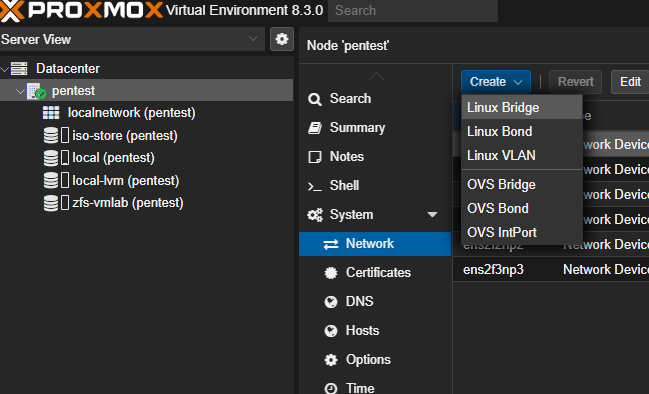

setting ipv4 as 10.8.0.1/24

## creating a vm in GUI

creating openvpn vm server

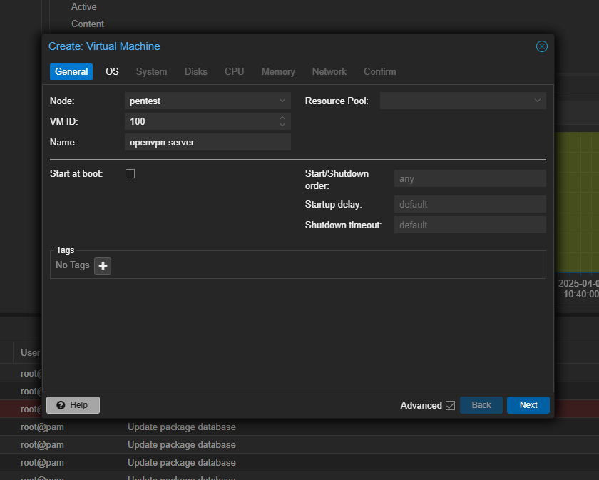

also checked start at boot

changed storage to zfs-vmlab

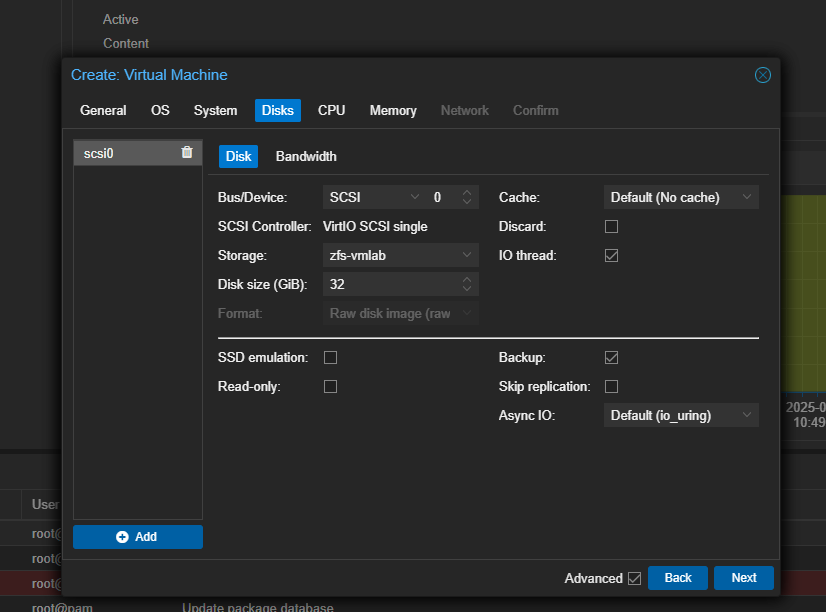

changed cpu type to host for better performance

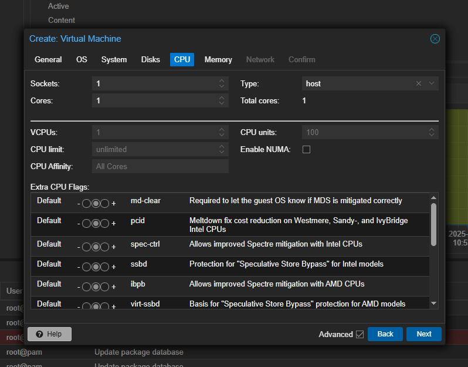

memory, feeling generous and giving 4gb instead of 2gb

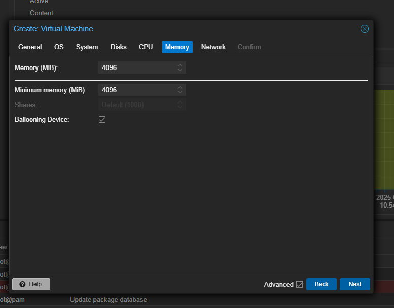

network:

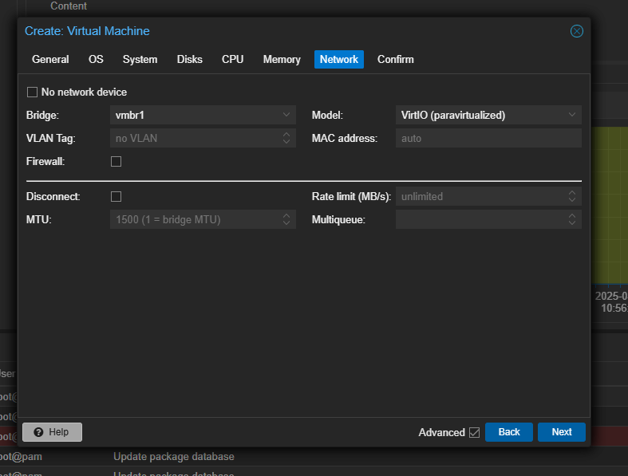

summary:

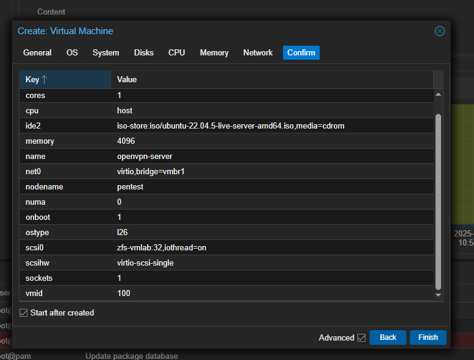

## issues on first start

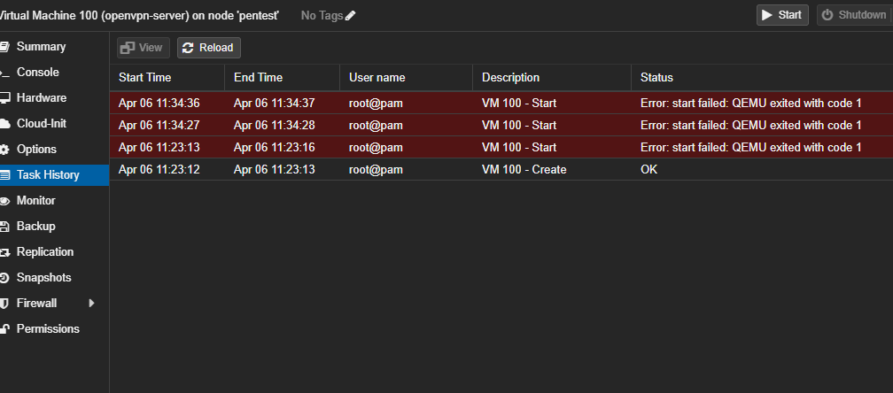

seems i forgot to apply the network configuration, vmbr1 is active=no

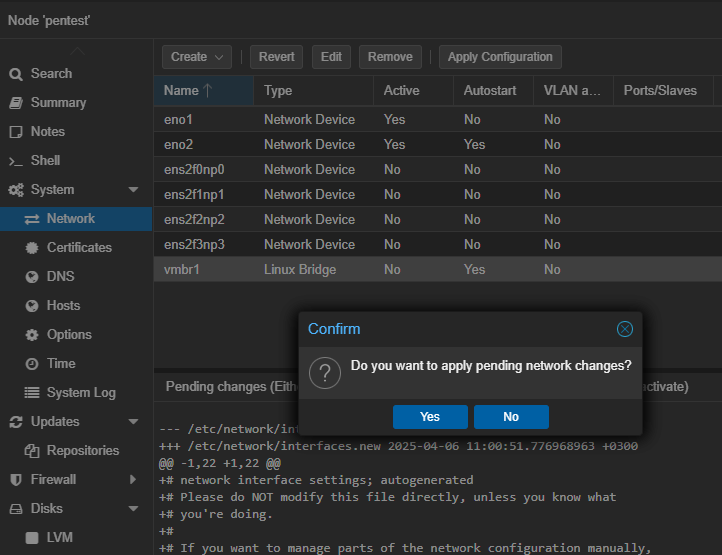

now vm is starting and i can continue

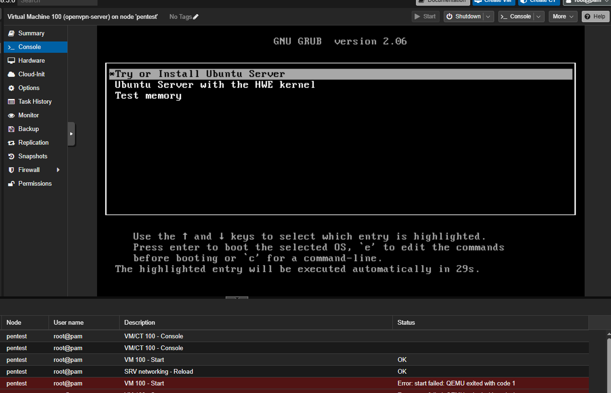

## openvpn setup on proxmox

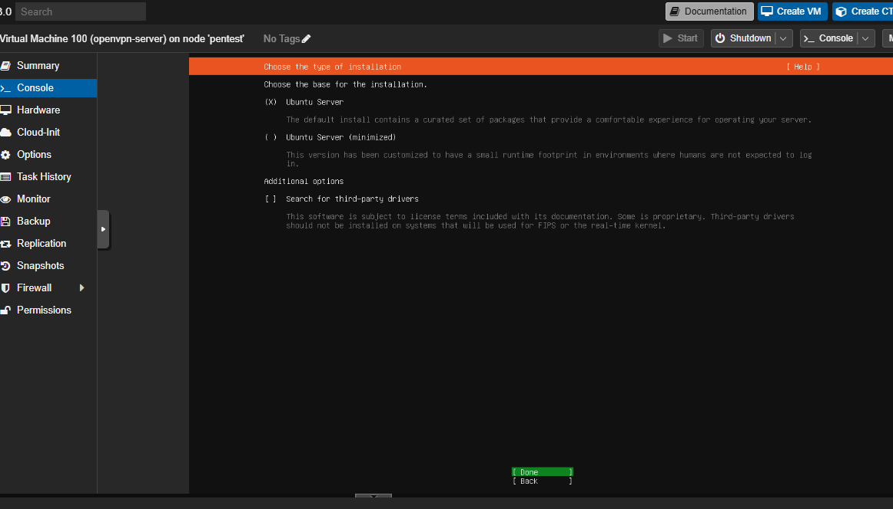

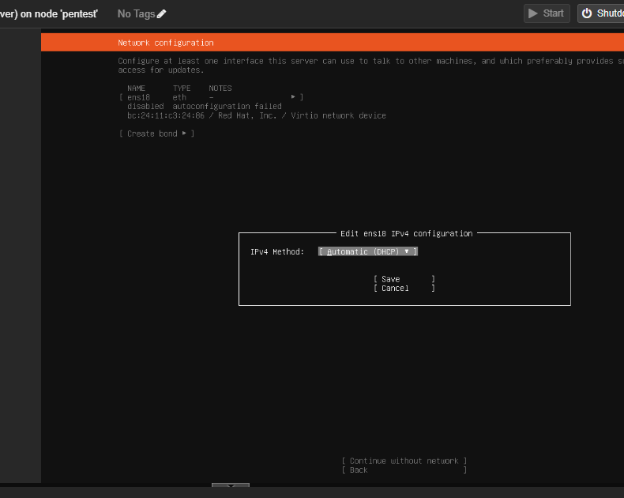

edit dhcp to manual:

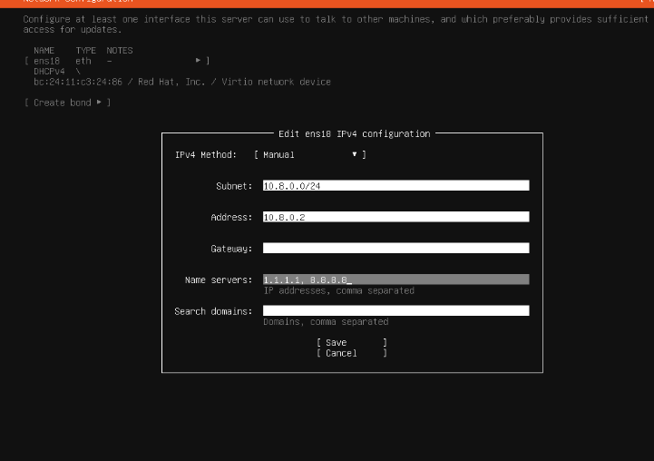

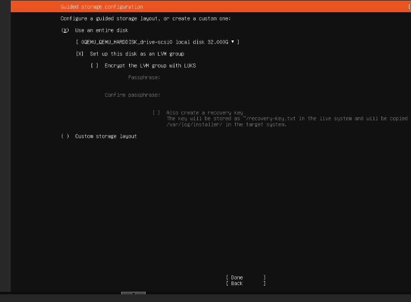

choosing enable ssh 

skip ubuntu pro, install

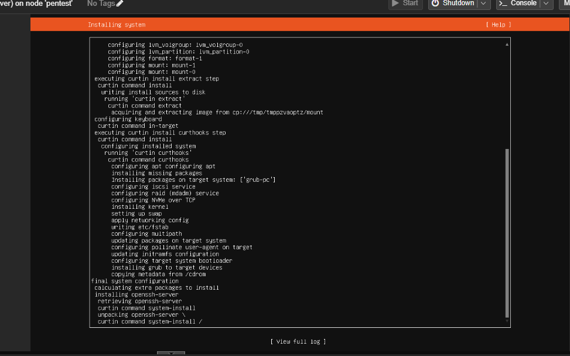

rebooting

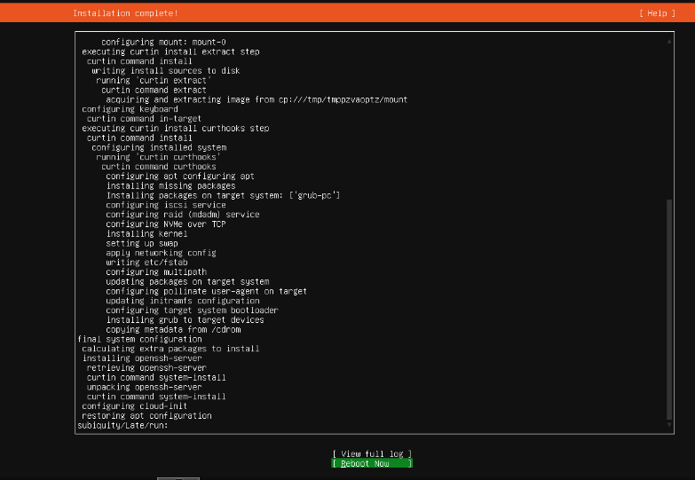

booting failed, iso image still mounted, removing it under hardware tab

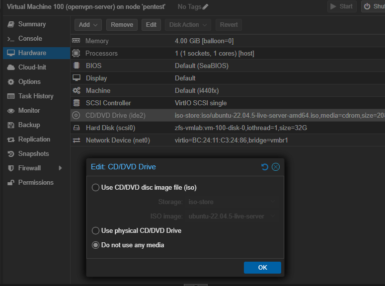

now it works

---

Setting up wg for rest of project members

