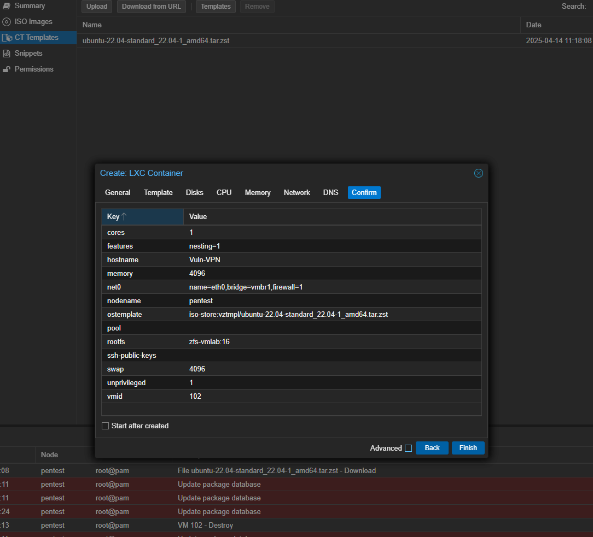
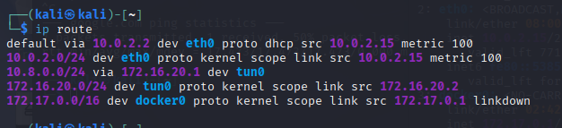
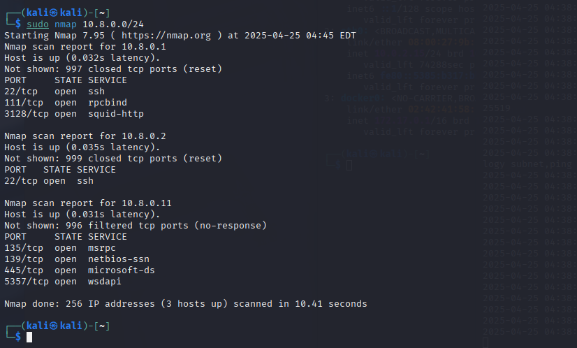
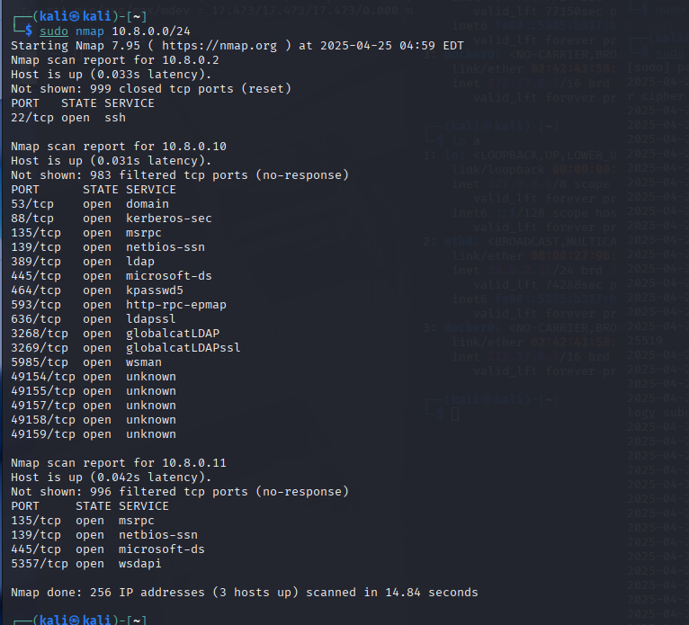

# retrying openvpn server setup after some issues

setting up a new openvpn, this time following another guide creating a container instead of a vm

after several trials and errors the vpn network now works

the vpn config is  setup so that only 10.8.0.0/24 traffic is routed:

here is nmap after connecting to the network

we still want to restrict access to 10.8.0.1 and .2

dropping .1 with:

`sudo iptables -I FORWARD -s 172.16.20.0/24 -d 10.8.0.1 -j DROP`

enabling our second target computer and testing after drop

disabling ssh from inside the tunnnel network into the openvpn server

`sudo iptables -I INPUT -i tun0 -p tcp --dport 22 -j REJECT` 

still shows, so need to hide it with disabling icmp

`sudo iptables -A INPUT -i tun0 -p icmp --icmp-type echo-request -j DROP`

now only shows as filtered.

