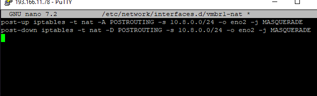
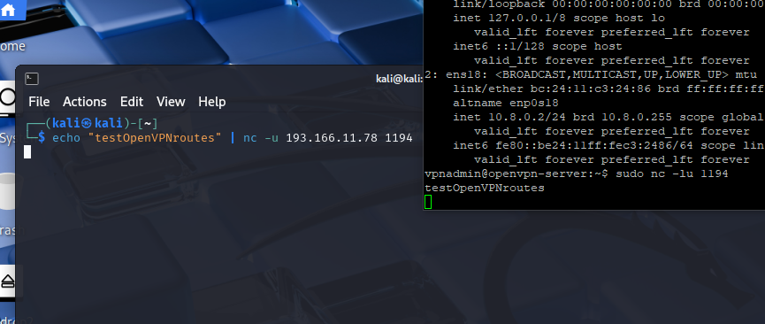

# openvpn inside vulnerable lab  network

after installing ubuntu 2204 and ssh via our main host

```
sudo apt update && sudo apt install openvpn easy-rsa -y
```

ofc. we dont have internet access since vmbr1 is isolated.

## temporarily allowing access:

This part took a lot of figuring out and trying to find the best practice, but for now setting proxmox host as gateway + nat router


on proxmoxhost:

creating /etc/network/interfaces/vmbr1-nat



or

```
iptables -t nat -A POSTROUTING -s 10.8.0.0/24 -o eno2 -j MASQUERADE
iptables -A FORWARD -s 10.8.0.0/24 -o eno2 -j ACCEPT
iptables -A FORWARD -d 10.8.0.0/24 -m state --state ESTABLISHED,RELATED -i eno2 -j ACCEPT
```

setting up netplan on openvpn vm

`sudo nano /etc/netplan/01-openvpn-static.yaml`

```
network:
  version: 2
  ethernets:
    ens18:
      addresses: [10.8.0.2/24]
      nameservers:
        addresses: [1.1.1.1, 8.8.8.8]
      routes:
        - to: 0.0.0.0/0
          via: 10.8.0.1
```

`sudo netplan apply`

finally ping to google.com works, now we can use apt
---
## routing 1194 from proxmox to openvpn


`export VPN_IP="10.8.0.2"`

`iptables -t nat -A PREROUTING -i eno2 -p udp --dport 1194 -j DNAT --to-destination ${VPN_IP}:1194
`

`iptables -A FORWARD -p udp -d ${VPN_IP} --dport 1194 -j ACCEPT
`

`apt install iptables-persistent`

testing echo from outside to openvpn-vm



---

## openvpn setup

after contemplating many different plugins and custom solutions to implement the openvpn structure for players, i decided to try this
https://github.com/theevilsyn/ctfd-vpn-plugin 

### on ctfd server @hetzner


### on the openvpn-vm @onprem


`sudo apt update`

```
sudo apt install openvpn easy-rsa -y
```

